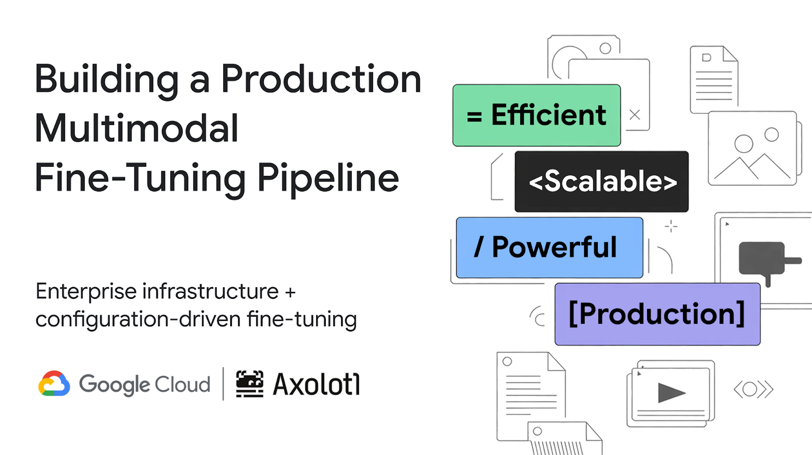
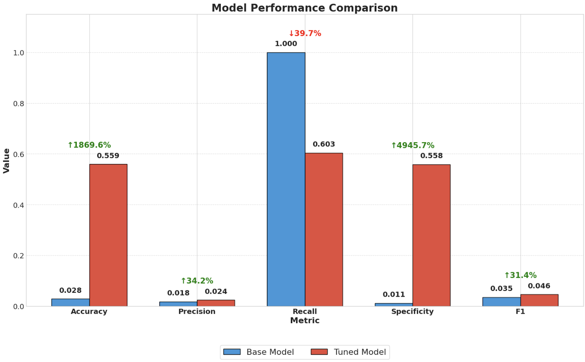

<br/>
<br/>

# Multimodal Fine-tuning with Gemma 3 and Axolotl for Melanoma Detection


This repository demonstrates how to fine-tune Gemma 3, a multimodal AI model, on the SIIM-ISIC Melanoma Classification dataset using Axolotl and Google Kubernetes Engine (GKE). The implementation provides a complete pipeline for preparing medical imaging data, fine-tuning, and evaluating model performance.



## Overview

Medical imaging applications require specialized knowledge that general-purpose AI models may lack. This repository shows how domain-specific fine-tuning can transform Gemma 3 into a model with enhanced capabilities for dermatological image analysis, specifically for melanoma detection.

Key components include:
- Data preparation for multimodal fine-tuning
- GKE-based training infrastructure
- Model evaluation and performance analysis
- Practical examples and complete implementation

## Prerequisites

Before starting, ensure you have:

- Google Cloud account with GKE access
- Hugging Face account with access to Gemma 3 models
- Google Cloud Storage bucket for data and model storage
- `gsutil` and `kubectl` installed and configured
- Python 3.8+ environment

### Authentication

```bash
# Authenticate with Google Cloud
gcloud auth login
gcloud config set project YOUR_PROJECT_ID

# Set up Hugging Face credentials
# 1. Create a token at https://huggingface.co/settings/tokens
# 2. Replace YOUR_TOKEN in the code below

# Create environment variables
export HF_TOKEN=YOUR_TOKEN
export GCS_BUCKET=YOUR_GCS_BUCKET_NAME
```

## Repository Structure

```
gke-multimodal-fine-tune-gemma-3-axolotl/
├── README.md                  # This file
├── data/
│   └── DataPreparation.ipynb  # Notebook for preparing SIIM-ISIC dataset for Axolotl
├── config/
│   └── gemma3-melanoma.yaml   # Axolotl configuration file
├── k8s/                       # Kubernetes manifests
│   ├── pvc.yaml               # Persistent volume claim
│   ├── axolotl-training-job.yaml  # Training job definition
│   ├── tensorboard.yaml       # TensorBoard deployment
│   └── model-export.yaml      # Model export pod
├── evaluation/
│   └── Evaluation.ipynb       # Notebook with model evaluation code
└── img/                       # Images used in README
    ├── architecture/          # Architecture diagrams
    └── results/               # Results visualizations
```

## Implementation Steps

### 1. Data Preparation

The SIIM-ISIC Melanoma Classification dataset requires specific formatting for multimodal fine-tuning. Follow these steps:

```bash
# Clone the repository
git clone https://github.com/your-username/gke-multimodal-fine-tune-gemma-3-axolotl.git
cd gke-multimodal-fine-tune-gemma-3-axolotl

# Run the data preparation notebook
jupyter notebook data/DataPreparation.ipynb
```

The notebook guides you through:
- Downloading the dataset using Storage Transfer Service
- Extracting and processing image files
- Creating properly formatted training data for Axolotl
- Splitting data into training/validation/test sets

### 2. Setting up GKE for Training

Create a GKE Autopilot cluster for training:

```bash
# Create a GKE Autopilot cluster
gcloud container clusters create-auto melanoma-training-cluster \
  --location=us-central1 \
  --project=your-project-id \
  --release-channel=regular

# Configure kubectl to use the cluster
gcloud container clusters get-credentials melanoma-training-cluster \
  --location=us-central1 \
  --project=your-project-id
```

### 3. Configuring and Running Training

Apply the Kubernetes configurations:

```bash
# Create persistent volume claim
kubectl apply -f k8s/pvc.yaml

# Create ConfigMap for Axolotl configuration
kubectl create configmap axolotl-config --from-file=config/gemma3-melanoma.yaml

# Create secrets for authentication
kubectl create secret generic huggingface-credentials \
  --from-literal=token=$HF_TOKEN

# Create service account credentials
# (Follow steps in blog post for creating service account with proper permissions)
kubectl create secret generic gcp-credentials \
  --from-file=service-account.json

# Deploy training job
kubectl apply -f k8s/axolotl-training-job.yaml

# Monitor training progress
POD_NAME=$(kubectl get pods --selector=job-name=gemma3-melanoma-training -o jsonpath='{.items[0].metadata.name}')
kubectl logs -f $POD_NAME
```

### 4. Monitoring with TensorBoard

Set up TensorBoard to monitor training metrics:

```bash
# Deploy TensorBoard
kubectl apply -f k8s/tensorboard.yaml

# Get TensorBoard external IP
kubectl get service tensorboard
```

Navigate to the external IP address in your browser to view training metrics.

### 5. Export and Evaluate the Model

After training completes, export the model:

```bash
# Export model to Cloud Storage
kubectl apply -f k8s/model-export.yaml
```

Then run evaluation using the Evaluation notebook:

```bash
# Run the evaluation notebook
jupyter notebook evaluation/Evaluation.ipynb
```

The notebook guides you through:
- Loading both base and fine-tuned models
- Running inference on test images
- Calculating performance metrics
- Visualizing results
- Analyzing improvements

## Performance Results

Our fine-tuned model demonstrated significant improvements over the base model:

| Metric | Base Model | Fine-tuned Model | Improvement |
|--------|------------|------------------|-------------|
| Accuracy | 0.028 | 0.559 | +1869.6% |
| Precision | 0.018 | 0.024 | +34.2% |
| Recall | 1.000 | 0.603 | -39.7% |
| Specificity | 0.011 | 0.558 | +4945.7% |
| Balanced Accuracy | 0.506 | 0.581 | +14.8% |

The most notable finding was the base model's tendency to over-diagnose melanoma, showing perfect recall (1.000) but extremely poor specificity (0.011). Fine-tuning significantly improved the model's ability to correctly identify benign lesions, dramatically reducing false positives while maintaining reasonable sensitivity.

## Key Implementation Notes

### GCS FUSE Paths

When using GKE with GCS FUSE for mounting Cloud Storage buckets, the bucket itself becomes the mount point. Our implementation creates paths in the format `/mnt/gcs/processed_images/...` instead of `/mnt/gcs/{BUCKET_NAME}/processed_images/...` to ensure compatibility with GCS FUSE mounting in Kubernetes.

### QLoRA Fine-Tuning

We use QLoRA (Quantized Low-Rank Adaptation) with 4-bit quantization to efficiently fine-tune the model while keeping memory requirements manageable. This approach allows training with larger batch sizes or sequence lengths if needed, providing additional flexibility for our melanoma classification task.

### Prompt Format

For consistent evaluation, we use a standardized prompt for all models:

```
This is a skin lesion image. Does this appear to be malignant melanoma? 
Please explain your reasoning and conclude with either 'Yes, this appears 
to be malignant melanoma.' or 'No, this does not appear to be malignant melanoma.'
```

## Troubleshooting

### Common Issues

1. **Missing adapter files**: Ensure that `adapter_config.json` and `adapter_model.safetensors` are properly downloaded during model export.

   ```bash
   # Check contents of tuned model directory
   gsutil ls -l gs://$GCS_BUCKET/tuned-models/
   ```

2. **GCS FUSE mounting issues**: Make sure your pod has proper permissions to access GCS buckets.

3. **Training failures**: Check job logs for errors:

   ```bash
   kubectl logs $(kubectl get pods --selector=job-name=gemma3-melanoma-training -o jsonpath='{.items[0].metadata.name}')
   ```

4. **Hugging Face token access**: Verify your token has appropriate permissions to access Gemma 3 models.

### Support

For questions or issues:
- Open an issue in this repository
- Refer to the [Axolotl documentation](https://github.com/OpenAccess-AI-Collective/axolotl)
- Check Google Cloud's [GKE documentation](https://cloud.google.com/kubernetes-engine/docs)

## Acknowledgments

- Dataset: SIIM-ISIC Melanoma Classification Challenge
- Axolotl: Open-source fine-tuning framework
- Google Cloud: Infrastructure and GKE environment
- Gemma 3: Multimodal foundation model

## License

This project is licensed under the Apache 2.0 License - see the LICENSE file for details.

## Citation

If you use this code in your research or project, please cite:

```
@misc{gke-multimodal-finetune-gemma-2025,
  author = {Your Name},
  title = {Multimodal Fine-tuning with Gemma 3 and Axolotl for Melanoma Detection},
  year = {2025},
  publisher = {GitHub},
  journal = {GitHub repository},
  howpublished = {\url{https://github.com/your-username/gke-multimodal-fine-tune-gemma-3-axolotl}}
}
```

## Next Steps

- Explore advanced techniques for improving medical image classification
- Apply this framework to other medical imaging domains
- Implement more sophisticated data augmentation for improved performance
- Integrate with clinical workflows for real-world evaluation
# gke-multimodal-fine-tune-gemma-3-axolotl
